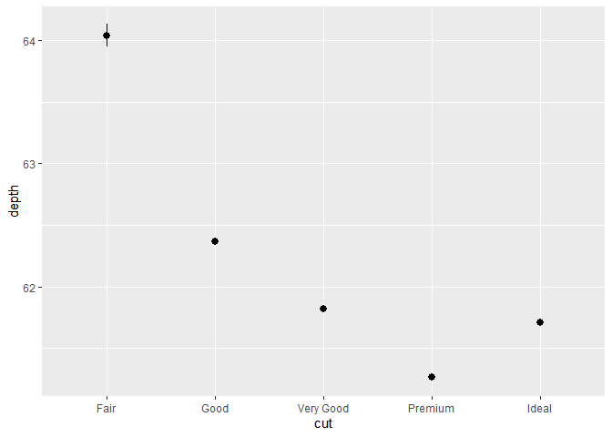
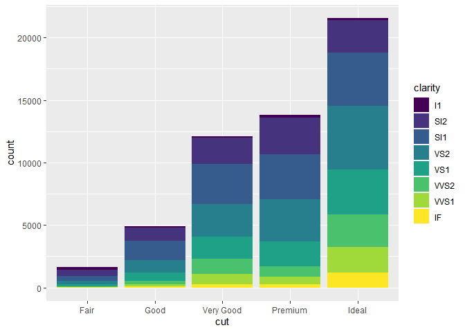

R for Data Science
================
ARU
9/26/2020

## Introduction


## Data Visualisation

Do cars with big engines use more fuel than cars with small engines?

  - `displ`, a car’s engine size, in litres.

  - `hwy`, a car’s fuel efficiency on the highway, in miles per gallon
    (mpg). A car with a low fuel efficiency consumes more fuel than a
    car with a high fuel efficiency when they travel the same distance.

<!-- end list -->

``` r
mpg
```

    ## # A tibble: 234 x 11
    ##    manufacturer model    displ  year   cyl trans   drv     cty   hwy fl    class
    ##    <chr>        <chr>    <dbl> <int> <int> <chr>   <chr> <int> <int> <chr> <chr>
    ##  1 audi         a4         1.8  1999     4 auto(l~ f        18    29 p     comp~
    ##  2 audi         a4         1.8  1999     4 manual~ f        21    29 p     comp~
    ##  3 audi         a4         2    2008     4 manual~ f        20    31 p     comp~
    ##  4 audi         a4         2    2008     4 auto(a~ f        21    30 p     comp~
    ##  5 audi         a4         2.8  1999     6 auto(l~ f        16    26 p     comp~
    ##  6 audi         a4         2.8  1999     6 manual~ f        18    26 p     comp~
    ##  7 audi         a4         3.1  2008     6 auto(a~ f        18    27 p     comp~
    ##  8 audi         a4 quat~   1.8  1999     4 manual~ 4        18    26 p     comp~
    ##  9 audi         a4 quat~   1.8  1999     4 auto(l~ 4        16    25 p     comp~
    ## 10 audi         a4 quat~   2    2008     4 manual~ 4        20    28 p     comp~
    ## # ... with 224 more rows

``` r
summary(cars)
```

    ##      speed           dist       
    ##  Min.   : 4.0   Min.   :  2.00  
    ##  1st Qu.:12.0   1st Qu.: 26.00  
    ##  Median :15.0   Median : 36.00  
    ##  Mean   :15.4   Mean   : 42.98  
    ##  3rd Qu.:19.0   3rd Qu.: 56.00  
    ##  Max.   :25.0   Max.   :120.00

``` r
ggplot(data = mpg) + 
  geom_point(mapping = aes(x = displ, y = hwy))
```

<!-- -->

The plot above shows a negative relationship between engine size
(`displ`) and fuel efficiency (`hwy`). In other words, cars with big
engines use more fuel.

### Exercises

`class` vs `drv`

``` r
ggplot(data = mpg)
```

<!-- -->

``` r
nrow(mpg)
```

    ## [1] 234

``` r
ggplot(mpg, aes(x = cyl, y = hwy)) +
  geom_point()
```

<!-- -->

``` r
ggplot(mpg, aes(x = class, y = drv)) +
  geom_point() +
  geom_count()
```

<!-- -->

``` r
mpg %>%
  count(class, drv) %>%
  ggplot(aes(x = class, y = drv)) +
    geom_tile(mapping = aes(fill = n))
```

<!-- --> In the
previous plot, there are many missing tiles. These missing tiles
represent unobserved combinations of `class` and `drv` values. These
missing values are not unknown, but represent values of (`class`, `drv`)
where `n = 0`. The `complete()` function in the tidyr package adds new
rows to a data frame for missing combinations of columns. The following
code adds rows for missing combinations of `class` and `drv` and uses
the fill argument to set `n = 0` for those new rows.

``` r
mpg %>%
  count(class, drv) %>%
  complete(class, drv, fill = list(n = 0)) %>%
  ggplot(aes(x = class, y = drv)) +
    geom_tile(mapping = aes(fill = n))
```

<!-- -->

### Aesthetic mappings

You can add a third variable, like `class`, to a two dimensional
scatterplot by mapping it to an aesthetic. An aesthetic is a visual
property of the objects in your plot. Aesthetics include things like the
size, the shape, or the color of your points.

``` r
ggplot(data = mpg) + 
  geom_point(mapping = aes(x = displ, y = hwy, color = class))
```

<!-- -->

The colors reveal that many of the unusual points are two-seater cars.
These cars don’t seem like hybrids, and are, in fact, sports cars\!
Sports cars have large engines like SUVs and pickup trucks, but small
bodies like midsize and compact cars, which improves their gas mileage.
In hindsight, these cars were unlikely to be hybrids since they have
large engines.

The exact size of each point would reveal its class affiliation. We get
a warning here, because mapping an unordered variable (`class`) to an
ordered aesthetic (`size`) is not a good idea.

``` r
ggplot(data = mpg) + 
  geom_point(mapping = aes(x = displ, y = hwy, size = class))
```

<!-- -->

``` r
ggplot(data = mpg) + 
  geom_point(mapping = aes(x = displ, y = hwy, size = class))
```

<!-- -->

``` r
ggplot(data = mpg) + 
  geom_point(mapping = aes(x = displ, y = hwy, alpha = class))
```

<!-- -->

``` r
ggplot(data = mpg) + 
  geom_point(mapping = aes(x = displ, y = hwy, shape = class))
```

<!-- -->

What happened to the SUVs? ggplot2 will only use six shapes at a time.
By default, additional groups will go unplotted when you use the shape
aesthetic.


### Exercises

``` r
ggplot(data = mpg) + 
  geom_point(mapping = aes(x = displ, y = hwy, color = "blue"))
```

<!-- -->

``` r
ggplot(data = mpg) + 
  geom_point(mapping = aes(x = displ, y = hwy), color = "blue")
```

<!-- -->

``` r
glimpse(mpg)
```

    ## Rows: 234
    ## Columns: 11
    ## $ manufacturer <chr> "audi", "audi", "audi", "audi", "audi", "audi", "audi"...
    ## $ model        <chr> "a4", "a4", "a4", "a4", "a4", "a4", "a4", "a4 quattro"...
    ## $ displ        <dbl> 1.8, 1.8, 2.0, 2.0, 2.8, 2.8, 3.1, 1.8, 1.8, 2.0, 2.0,...
    ## $ year         <int> 1999, 1999, 2008, 2008, 1999, 1999, 2008, 1999, 1999, ...
    ## $ cyl          <int> 4, 4, 4, 4, 6, 6, 6, 4, 4, 4, 4, 6, 6, 6, 6, 6, 6, 8, ...
    ## $ trans        <chr> "auto(l5)", "manual(m5)", "manual(m6)", "auto(av)", "a...
    ## $ drv          <chr> "f", "f", "f", "f", "f", "f", "f", "4", "4", "4", "4",...
    ## $ cty          <int> 18, 21, 20, 21, 16, 18, 18, 18, 16, 20, 19, 15, 17, 17...
    ## $ hwy          <int> 29, 29, 31, 30, 26, 26, 27, 26, 25, 28, 27, 25, 25, 25...
    ## $ fl           <chr> "p", "p", "p", "p", "p", "p", "p", "p", "p", "p", "p",...
    ## $ class        <chr> "compact", "compact", "compact", "compact", "compact",...

The argument `colour = "blue"` is included within the `mapping`
argument, and as such, it is treated as an aesthetic, which is a mapping
between a variable and a value. In the expression, `colour = "blue"`,
`"blue"` is interpreted as a categorical variable which only takes a
single value `"blue"`. If this is confusing, consider how `colour
= 1:234` and `colour = 1` are interpreted by `aes()`.

Map a continuous variable to color, size, and shape. How do these
aesthetics behave differently for categorical vs. continuous variables?

``` r
ggplot(mpg, aes(x = displ, y = hwy, colour = cty)) +
  geom_point()
```

<!-- -->

``` r
ggplot(mpg, aes(x = displ, y = hwy, size = cty)) +
  geom_point()
```

<!-- -->

``` r
# ggplot(mpg, aes(x = displ, y = hwy, shape = cty)) +
#   geom_point()
```

What happens if you map the same variable to multiple aesthetics? -
Redundancy\!

``` r
ggplot(mpg, aes(x = displ, y = hwy, colour = hwy, size = displ)) +
  geom_point()
```

<!-- -->

What does the stroke aesthetic do? What shapes does it work with? (Hint:
use ?geom\_point)

  - Stroke changes the size of the border for shapes (21-25). These are
    filled shapes in which the color and size of the border can differ
    from that of the filled interior of the shape.

<!-- end list -->

``` r
ggplot(mtcars, aes(wt, mpg)) +
  geom_point(shape = 21, colour = "black", fill = "white", size = 5, stroke = 5)
```

<!-- -->

What happens if you map an aesthetic to something other than a variable
name, like `aes(colour = displ < 5)`?

``` r
ggplot(mpg, aes(x = displ, y = hwy, colour = displ < 5)) +
  geom_point()
```

<!-- -->

## Facets

The first argument of `facet_wrap()` should be a formula, which you
create with `~` followed by a variable name (here “formula” is the name
of a data structure in R, not a synonym for “equation”). The variable
that you pass to `facet_wrap()` should be discrete.

``` r
ggplot(data = mpg) + 
  geom_point(mapping = aes(x = displ, y = hwy)) + 
  facet_wrap(~ class, nrow = 2)
```

<!-- -->

To facet your plot on the combination of two variables, add
`facet_grid()` to your plot call. The first argument of `facet_grid()`
is also a formula. This time the formula should contain two variable
names separated by a `~`.

``` r
ggplot(data = mpg) + 
  geom_point(mapping = aes(x = displ, y = hwy)) + 
  facet_grid(drv ~ cyl)
```

<!-- -->

If you prefer to not facet in the rows or columns dimension, use a `.`
instead of a variable name, e.g. `+ facet_grid(. ~ cyl)`.

### Exercises

``` r
ggplot(data = mpg) + 
  geom_point(mapping = aes(x = displ, y = hwy)) + 
  facet_grid(. ~ displ)
```

<!-- -->

What do the empty cells in plot with `facet_grid(drv ~ cyl)` mean? How
do they relate to this plot?

``` r
ggplot(data = mpg) +
  geom_point(mapping = aes(x = drv, y = cyl))
```

<!-- -->

The empty cells (facets) in this plot are combinations of drv and cyl
that have no observations. These are the same locations in the scatter
plot of drv and cyl that have no points.

``` r
ggplot(data = mpg) +
  geom_point(mapping = aes(x = hwy, y = cty)) +
  facet_grid(drv ~ cyl)
```

<!-- -->

``` r
ggplot(data = mpg) + 
  geom_point(mapping = aes(x = drv, y = cyl))
```

<!-- -->

What plots does the following code make? What does `.` do?

The symbol `.` ignores that dimension when faceting. For example, drv \~
. facet by values of drv on the y-axis.

``` r
ggplot(data = mpg) +
  geom_point(mapping = aes(x = displ, y = hwy)) +
  facet_grid(drv ~ .)
```

<!-- -->

What are the advantages to using faceting instead of the colour
aesthetic? What are the disadvantages? How might the balance change if
you had a larger dataset?

``` r
ggplot(data = mpg) + 
  geom_point(mapping = aes(x = displ, y = hwy)) + 
  facet_wrap(~ class, nrow = 2)
```

<!-- -->

``` r
ggplot(data = mpg) +
  geom_point(mapping = aes(x = displ, y = hwy, color = class))
```

<!-- -->

Advantages of encoding `class` with facets instead of color include the
ability to encode more distinct categories. For me, it is difficult to
distinguish between the colors of `"midsize"` and `"minivan"`.

Given human visual perception, the max number of colors to use when
encoding unordered categorical (qualitative) data is nine, and in
practice, often much less than that. Displaying observations from
different categories on different scales makes it difficult to directly
compare values of observations across categories. However, it can make
it easier to compare the shape of the relationship between the x and y
variables across categories.

Disadvantages of encoding the `class` variable with facets instead of
the color aesthetic include the difficulty of comparing the values of
observations between categories since the observations for each category
are on different plots. Using the same x- and y-scales for all facets
makes it easier to compare values of observations across categories, but
it is still more difficult than if they had been displayed on the same
plot. Since encoding class within color also places all points on the
same plot, it visualizes the unconditional relationship between the x
and y variables; with facets, the unconditional relationship is no
longer visualized since the points are spread across multiple plots.

The benefit of encoding a variable with facetting over encoding it with
color increase in both the number of points and the number of
categories. With a large number of points, there is often overlap. It is
difficult to handle overlapping points with different colors color.
Jittering will still work with color. But jittering will only work well
if there are few points and the classes do not overlap much, otherwise,
the colors of areas will no longer be distinct, and it will be hard to
pick out the patterns of different categories visually. Transparency
(`alpha`) does not work well with colors since the mixing of overlapping
transparent colors will no longer represent the colors of the
categories. Binning methods already use color to encode the density of
points in the bin, so color cannot be used to encode categories.

As the number of categories increases, the difference between colors
decreases, to the point that the color of categories will no longer be
visually distinct.

Read ?facet\_wrap. What does `nrow` do? What does `ncol` do? What other
options control the layout of the individual panels? Why doesn’t
`facet_grid()` have nrow and ncol variables?

The arguments nrow (ncol) determines the number of rows (columns) to use
when laying out the facets. It is necessary since `facet_wrap(`) only
facets on one variable.

The `nrow` and `ncol` arguments are unnecessary for `facet_grid()` since
the number of unique values of the variables specified in the function
determines the number of rows and columns.

When using `facet_grid()` you should usually put the variable with more
unique levels in the columns. Why? There will be more space for columns
if the plot is laid out horizontally (landscape).

## Geometric objects

A geom is the geometrical object that a plot uses to represent data.
People often describe plots by the type of geom that the plot uses. For
example, bar charts use bar geoms, line charts use line geoms, boxplots
use boxplot geoms, and so on. Scatterplots break the trend; they use the
point geom.

``` r
ggplot(data = mpg) + 
  geom_point(mapping = aes(x = displ, y = hwy))
```

<!-- -->

``` r
ggplot(data = mpg) + 
  geom_smooth(mapping = aes(x = displ, y = hwy))
```

    ## `geom_smooth()` using method = 'loess' and formula 'y ~ x'

<!-- -->

``` r
ggplot(data = mpg) + 
  geom_smooth(mapping = aes(x = displ, y = hwy, linetype = drv))
```

    ## `geom_smooth()` using method = 'loess' and formula 'y ~ x'

<!-- --> For these
geoms, you can set the group aesthetic to a categorical variable to draw
multiple objects. ggplot2 will draw a separate object for each unique
value of the grouping variable. In practice, ggplot2 will automatically
group the data for these geoms whenever you map an aesthetic to a
discrete variable.

``` r
ggplot(data = mpg) +
  geom_smooth(mapping = aes(x = displ, y = hwy))
```

    ## `geom_smooth()` using method = 'loess' and formula 'y ~ x'

<!-- -->

``` r
ggplot(data = mpg) +
  geom_smooth(mapping = aes(x = displ, y = hwy, group = drv))
```

    ## `geom_smooth()` using method = 'loess' and formula 'y ~ x'

<!-- -->

``` r
ggplot(data = mpg) +
  geom_smooth(
    mapping = aes(x = displ, y = hwy, color = drv),
    show.legend = FALSE
  )
```

    ## `geom_smooth()` using method = 'loess' and formula 'y ~ x'

<!-- --> To display
multiple geoms in the same plot, add multiple geom functions to
`ggplot()`:

``` r
ggplot(data = mpg) + 
  geom_point(mapping = aes(x = displ, y = hwy)) +
  geom_smooth(mapping = aes(x = displ, y = hwy))
```

    ## `geom_smooth()` using method = 'loess' and formula 'y ~ x'

<!-- --> If you
place mappings in a geom function, ggplot2 will treat them as local
mappings for the layer. It will use these mappings to extend or
overwrite the global mappings for that layer only. This makes it
possible to display different aesthetics in different layers.

``` r
ggplot(data = mpg, mapping = aes(x = displ, y = hwy)) + 
  geom_point(mapping = aes(color = class)) + 
  geom_smooth()
```

    ## `geom_smooth()` using method = 'loess' and formula 'y ~ x'

<!-- -->

You can use the same idea to specify different `data` for each layer.
Here, our smooth line displays just a subset of the `mpg` dataset, the
subcompact cars. The local data argument in `geom_smooth()` overrides
the global data argument in `ggplot()` for that layer only.

``` r
ggplot(data = mpg, mapping = aes(x = displ, y = hwy)) + 
  geom_point(mapping = aes(color = class)) + 
  geom_smooth(data = filter(mpg, class == "subcompact"), se = FALSE)
```

    ## `geom_smooth()` using method = 'loess' and formula 'y ~ x'

<!-- -->

### Exercises

Run this code in your head and predict what the output will look like.
Then, run the code in R and check your predictions.

``` r
ggplot(data = mpg, mapping = aes(x = displ, y = hwy, color = drv)) + 
  geom_point() + 
  geom_smooth(se = FALSE)
```

    ## `geom_smooth()` using method = 'loess' and formula 'y ~ x'

<!-- -->

``` r
ggplot(data = mpg, mapping = aes(x = displ, y = hwy)) + 
  geom_point() + 
  geom_smooth(se = FALSE)
```

    ## `geom_smooth()` using method = 'loess' and formula 'y ~ x'

<!-- -->

``` r
ggplot(data = mpg, aes(x = displ, y = hwy, group = drv)) +
  geom_smooth(se = FALSE) +
  geom_point()
```

    ## `geom_smooth()` using method = 'loess' and formula 'y ~ x'

<!-- -->

``` r
ggplot(data = mpg, aes(x = displ, y = hwy, group = drv, colour = drv)) +
  geom_smooth(se = FALSE) +
  geom_point()
```

    ## `geom_smooth()` using method = 'loess' and formula 'y ~ x'

<!-- -->

``` r
ggplot(data = mpg, mapping = aes(x = displ, y = hwy)) + 
  geom_point(aes(colour = drv)) + 
  geom_smooth(mapping = aes(x = displ, y = hwy), se = FALSE)
```

    ## `geom_smooth()` using method = 'loess' and formula 'y ~ x'

<!-- -->

``` r
ggplot(data = mpg, aes(x = displ, y = hwy)) +
  geom_smooth(aes(linetype = drv), se = FALSE) +
  geom_point(aes(colour = drv))
```

    ## `geom_smooth()` using method = 'loess' and formula 'y ~ x'

<!-- -->

``` r
ggplot(data = mpg, mapping = aes(x = displ, y = hwy, colour = drv)) + 
  geom_point(stroke = 5, show.legend = FALSE)
```

<!-- -->

``` r
ggplot(data = mpg, mapping = aes(x = displ, y = hwy)) +
  geom_point(size = 4, color = "white") +
  geom_point(aes(colour = drv))
```

<!-- -->

## Statistical Functions

Types of charts from stat algorithm-

  - bar charts, histograms, and frequency polygons bin your data and
    then plot bin counts, the number of points that fall in each bin.

  - smoothers fit a model to your data and then plot predictions from
    the model.

  - boxplots compute a robust summary of the distribution and then
    display a specially formatted box.

<!-- end list -->

``` r
ggplot(data = diamonds) + 
  stat_count(mapping = aes(x = cut))
```

<!-- -->

``` r
ggplot(data = diamonds) + 
  geom_bar(mapping = aes(x = cut))
```

<!-- -->

``` r
ggplot(data = diamonds) + 
  geom_bar(mapping = aes(x = cut, y = stat(prop), group = 1))
```

<!-- -->

``` r
ggplot(data = diamonds) + 
  stat_summary(
    mapping = aes(x = cut, y = depth),
    fun.min = min,
    fun.max = max,
    fun = median
  )
```

<!-- -->

### Exercises

The default geom for `stat_summary()` is `geom_pointrange()`. The
default stat for `geom_pointrange()` is `identity()` but we can add the
argument `stat = "summary"` to use `stat_summary()` instead of
`stat_identity()`.

``` r
ggplot(data = diamonds) + 
  geom_pointrange(
    mapping = aes(x = cut, y = depth),
    stat = "summary"
  )
```

    ## No summary function supplied, defaulting to `mean_se()`

<!-- -->

The resulting message says that `stat_summary()` uses the mean and sd to
calculate the middle point and endpoints of the line. However, in the
original plot the min and max values were used for the endpoints. To
recreate the original plot we need to specify values for `fun.min`,
`fun.max`, and `fun.`

``` r
ggplot(data = diamonds) +
  geom_pointrange(
    mapping = aes(x = cut, y = depth),
    stat = "summary",
    fun.min = min,
    fun.max = max,
    fun = median
  )
```

<!-- -->

What does `geom_col()` do? How is it different to `geom_bar()`?

The `geom_col()` function has different default stat than `geom_bar()`.
The default stat of `geom_col()` is `stat_identity()`, which leaves the
data as is. The `geom_col()` function expects that the data contains x
values and y values which represent the bar height.

The default stat of `geom_bar()` is `stat_count()`. The `geom_bar()`
function only expects an x variable. The stat, `stat_count()`,
preprocesses input data by counting the number of observations for each
value of x. The y aesthetic uses the values of these counts.

Most geoms and stats come in pairs that are almost always used in
concert. Read through the documentation and make a list of all the
pairs. What do they have in common?


These pairs of geoms and stats tend to have their names in common, such
`stat_smooth()` and `geom_smooth()` and be documented on the same help
page. The pairs of geoms and stats that are used in concert often have
each other as the default stat (for a geom) or geom (for a stat).

What variables does `stat_smooth()` compute? What parameters control its
behavior?

The function stat\_smooth() calculates the following variables:

`y`: predicted value `ymin`: lower value of the confidence interval
`ymax`: upper value of the confidence interval `se`: standard error

The “Computed Variables” section of the `stat_smooth()` documentation
contains these variables.

The parameters that control the behavior of stat\_smooth() include:

``` r
ggplot(data = diamonds) + 
  geom_bar(mapping = aes(x = cut, y = ..prop..))
```

<!-- -->

``` r
ggplot(data = diamonds) + 
  geom_bar(mapping = aes(x = cut, fill = color, y = ..prop..))
```

<!-- -->

The problem with these two plots is that the proportions are calculated
within the groups.

The following code will produce the intended stacked bar charts for the
case with no `fill` aesthetic.

``` r
ggplot(data = diamonds) +
  geom_bar(mapping = aes(x = cut, y = ..prop.., group = 1))
```

<!-- -->

With the `fill` aesthetic, the heights of the bars need to be
normalized.

``` r
ggplot(data = diamonds) + 
  geom_bar(aes(x = cut, y = ..count.. / sum(..count..), fill = color))
```

<!-- -->

``` r
ggplot(data = diamonds) + 
  geom_bar(mapping = aes(x = cut, colour = cut))
```

<!-- -->

``` r
ggplot(data = diamonds) + 
  geom_bar(mapping = aes(x = cut, fill = cut))
```

<!-- -->

Note what happens if you map the fill aesthetic to another variable,
like `clarity`: the bars are automatically stacked. Each colored
rectangle represents a combination of `cut` and `clarity.`

``` r
ggplot(data = diamonds) + 
  geom_bar(mapping = aes(x = cut, fill = clarity))
```

<!-- -->

`position = "identity"` will place each object exactly where it falls in
the context of the graph. This is not very useful for bars, because it
overlaps them. To see that overlapping we either need to make the bars
slightly transparent by setting `alpha` to a small value, or completely
transparent by setting `fill = NA`.

``` r
ggplot(data = diamonds, mapping = aes(x = cut, fill = clarity)) + 
  geom_bar(alpha = 1/5, position = "identity")
```

<!-- -->

``` r
ggplot(data = diamonds, mapping = aes(x = cut, colour = clarity)) + 
  geom_bar(fill = NA, position = "identity")
```

<!-- -->

`position = "fill"` works like stacking, but makes each set of stacked
bars the same height. This makes it easier to compare proportions across
groups.

``` r
ggplot(data = diamonds) + 
  geom_bar(mapping = aes(x = cut, fill = clarity), position = "fill")
```

<!-- -->

`position = "dodge"` places overlapping objects directly beside one
another. This makes it easier to compare individual values.

``` r
ggplot(data = diamonds) + 
  geom_bar(mapping = aes(x = cut, fill = clarity), position = "dodge")
```

<!-- -->

`position = "jitter"` adds a small amount of random noise to each point.
This spreads the points out because no two points are likely to receive
the same amount of random noise.

``` r
ggplot(data = mpg) + 
  geom_point(mapping = aes(x = displ, y = hwy), position = "jitter")
```

<!-- -->

### Exercises

``` r
ggplot(data = mpg, mapping = aes(x = cty, y = hwy)) + 
  geom_point(position = "jitter")
```

<!-- --> From the
geom\_jitter() documentation, there are two arguments to jitter:

`width` controls the amount of horizontal displacement, and `height`
controls the amount of vertical displacement.

``` r
ggplot(data = mpg, mapping = aes(x = cty, y = hwy)) +
  geom_jitter(width = 20)
```

<!-- -->

``` r
ggplot(data = mpg, mapping = aes(x = cty, y = hwy)) +
  geom_jitter(width = 0)
```

<!-- -->

The geom `geom_count()` sizes the points relative to the number of
observations. Combinations of (`x`, `y`) values with more observations
will be larger than those with fewer observations.

The geom `geom_jitter()` adds random variation to the locations points
of the graph. In other words, it “jitters” the locations of points
slightly.

The default position for `geom_boxplot()` is `"dodge2"`, which is a
shortcut for `position_dodge2`.

``` r
ggplot(data = mpg, aes(x = drv, y = hwy, colour = class)) +
  geom_boxplot()
```

<!-- -->

`position_identity()` is used the boxplots overlap.

``` r
ggplot(data = mpg, aes(x = drv, y = hwy, colour = class)) +
  geom_boxplot(position = "identity")
```

<!-- -->

## Coordinate systems

``` r
ggplot(data = mpg, mapping = aes(x = class, y = hwy)) + 
  geom_boxplot()
```

<!-- -->

``` r
ggplot(data = mpg, mapping = aes(x = class, y = hwy)) + 
  geom_boxplot() +
  coord_flip()  
```

<!-- -->

``` r
bar <- ggplot(data = diamonds) + 
  geom_bar(
    mapping = aes(x = cut, fill = cut), 
    show.legend = FALSE,
    width = 1
  ) + 
  theme(aspect.ratio = 1) +
  labs(x = NULL, y = NULL)

bar + coord_flip()
```

<!-- -->

``` r
bar + coord_polar()
```

<!-- -->

A pie chart is a stacked bar chart with the addition of polar
coordinates. Take this stacked bar chart with a single category.

``` r
ggplot(mpg, aes(x = factor(1), fill = drv)) +
  geom_bar()
```

<!-- -->

``` r
ggplot(mpg, aes(x = factor(1), fill = drv)) +
  geom_bar(width = 1) +
  coord_polar(theta = "y")
```

<!-- -->

``` r
ggplot(mpg, aes(x = factor(1), fill = drv)) +
  geom_bar(width = 1) +
  coord_polar()
```

<!-- -->

`labs` in ggplot

``` r
ggplot(data = mpg, mapping = aes(x = class, y = hwy)) +
  geom_boxplot() +
  coord_flip() +
  labs(y = "Highway MPG",
       x = "Class",
       title = "Highway MPG by car class",
       subtitle = "1999-2008",
       caption = "Source: http://fueleconomy.gov")
```

<!-- -->

What’s the difference between `coord_quickmap()` and `coord_map()`?

The `coord_map()` function uses map projections to project the
three-dimensional Earth onto a two-dimensional plane. By default,
`coord_map()` uses the Mercator projection. This projection is applied
to all the geoms in the plot. The `coord_quickmap()` function uses an
approximate but faster map projection. This approximation ignores the
curvature of Earth and adjusts the map for the latitude/longitude ratio.
The `coord_quickmap()` project is faster than `coord_map(`) both because
the projection is computationally easier, and unlike `coord_map()`, the
coordinates of the individual geoms do not need to be transformed.

The function `coord_fixed()` ensures that the line produced by
`geom_abline()` is at a 45-degree angle. A 45-degree line makes it easy
to compare the highway and city mileage to the case in which city and
highway MPG were equal.

``` r
p <- ggplot(data = mpg, mapping = aes(x = cty, y = hwy)) +
  geom_point() +
  geom_abline()
p + coord_fixed()
```

<!-- -->

``` r
p
```

<!-- -->
